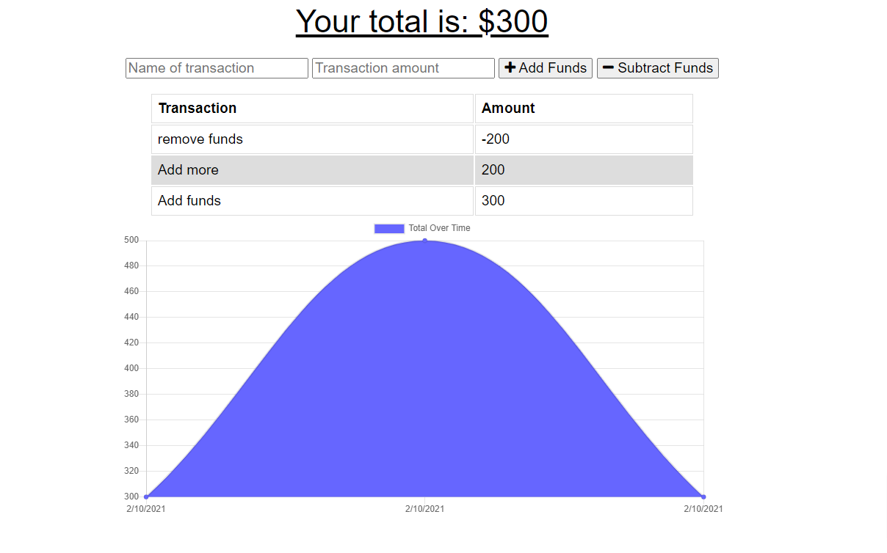

## Online Offline Budget Trackers

- [Description](#Description)
- [Installations](#Installations)
- [Licence](#Licence)
- [Contributing](#Contributing)
- [User Story](#User-Story)
- [Acceptance Criteria](#Acceptance-Criteria)
- [Test](#Test)
- [Credits](#Credits)
- [Questions](#Questions)

## Description

This app tracks the user transactions, on and off line.

## Installations

`npm i`

## Contributing

None at this time

## User-Story

```
AS AN avid traveller
I WANT to be able to track my withdrawals and deposits with or without a data/internet connection
SO THAT my account balance is accurate when I am traveling

Giving users a fast and easy way to track their money is important, but allowing them to access that information anytime is even more important. Having offline functionality is paramount to our applications success.
```

## Acceptance-Criteria

```
GIVEN a user is on Budget App without an internet connection
WHEN the user inputs a withdrawal or deposit
THEN that will be shown on the page, and added to their transaction history when their connection is back online.
```

## Licence

[](https://opensource.org/licenses/MIT)

## Test

[](https://enline-offline-budget.herokuapp.com/)

## Credits

Trilogy, Teachers, TAs and Staff

## Questions
Contact me on my socials
<br>
-Email: [danielsoledad@gmail.com](mailto:danielsoledad@gmail.com)
<br>
-GitHub Username: [tuzosdaniel12](https://github.com/tuzosdaniel12) 
